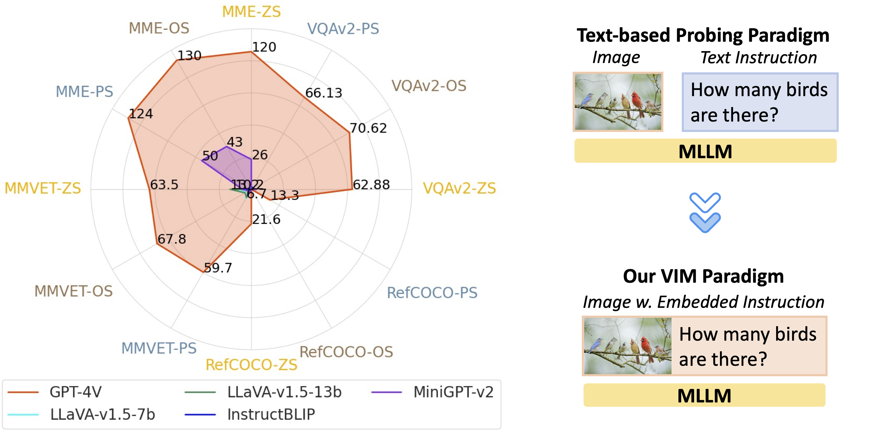
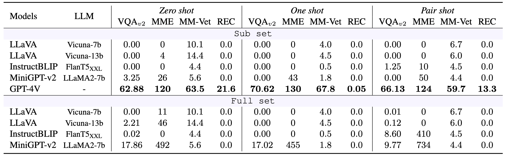
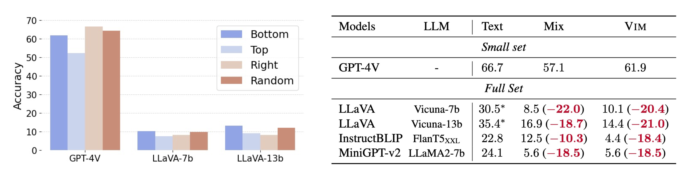

#  VIM: Probing Multimodal Large Language Models for Visual Embedded Instruction Following

<p align="center">
   🔥 <a href="https://vim-bench.github.io/" target="_blank">Project Page</a> 📃 <a href="https://arxiv.org/abs/2311.17647" target="_blank">Paper</a> 🐦 <a href="https://twitter.com/yujielu_10" target="_blank">Twitter</a> 🤗 <a href="https://huggingface.co/VIM-Bench" target="_blank">Model and Data</a><br>
</p>

We introduce VISUAL EMBEDDED INSTRUCTION (VIM), a new framework designed to evaluate the visual instruction following capability of Multimodal Large Language Models (MLLMs). VIM challenges the MLLMs by embedding the instructions into the visual scenes, demanding strong visual interpretative skills for instruction following.
Please check out our paper <a href="https://arxiv.org/abs/2311.17647" target="_blank">"VIM: Probing Multimodal Large Language Models for Visual Embedded Instruction Following"</a>.

## Overview
Probing results of five MLLMs for visual instruction following under our introduced VIM probing paradigm on four benchmarks VQAv2, MME, MM-Vet, and RefCOCO series, across three in-context learning settings ZS: Zero Shot , OS: One Shot, PS: Pair Shot.
<p align="center">
</img>
</p>

Zero shot evaluation paradigm comparison for MLLMs. (a) Left: Image + Text instruction as two separate modalities are fed into MLLMs for inference; (b) Right: VIM only takes the image modality with the text instruction embedded in the image , no additional text prompt is required. The above example is from MM-Vet (question #86). Note: Image modality input , Text modality input.
<p align="center">
</img>
</p>

Three in-context evaluation settings: (a) Left: Zero Shot has only one question to be answered; (b) Middle: One Shot, the image is composed of one image-instruction-answer as a reference, the answer for the second image-instruction query is required; (c) Right: Pair Shot, the image is composed of two image-instruction pairs, and answer for both are required.

<p align="center">
</img>
</p>

Main quantitative results over each benchmark, including sub set and full set for three settings.
<p align="center">
</img>
</p>

Left: Exploration setup for instruction location on zero shot evaluation for MM-Vet. Right: Exploration setup for text prompt on zero shot evaluation for MM-Vet. * denotes from the origin paper reported.
<p align="center">
</img>
</p>

Our results highlight a promising direction for the enhancement of MLLMs capabilities on instruction following. We aim VIM to serve as a useful norm for advancing the state of the art and driving further progress in the field.

## Installation
Please follow [install](INSTALL.md) page to set up the environments and models.

## Applying VIM for Customized Dataset

### In-context Learning Setting
First, please preprocess the dataset file accordingly. Then apply VIM to the source dataset (e.g., mme) under zero/one/pair shot setting accordingly.

**Zero-shot:**
```
bash scripts/convert_probe_bench.sh zs mme
```
**One-shot:**
```
bash scripts/convert_probe_bench.sh os mme
```
**Pair-shot:**
```
bash scripts/convert_probe_bench.sh ps mme
```

## Citation

If you found this repository useful, please consider cite our paper:

```bibtex
@misc{lu2023vim,
      title={VIM: Probing Multimodal Large Language Models for Visual Embedded Instruction Following}, 
      author={Yujie Lu and Xiujun Li and William Yang Wang and Yejin Choi},
      year={2023},
      eprint={2311.17647},
      archivePrefix={arXiv},
      primaryClass={cs.CV}
}
```
